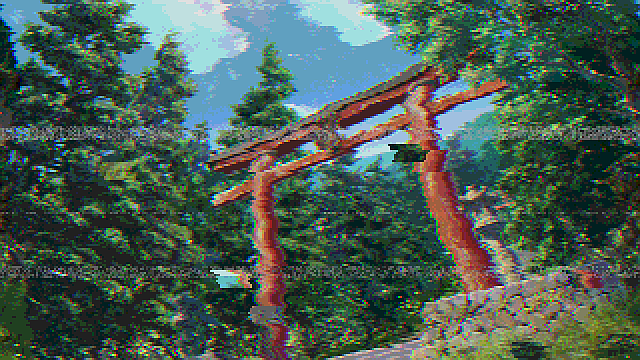
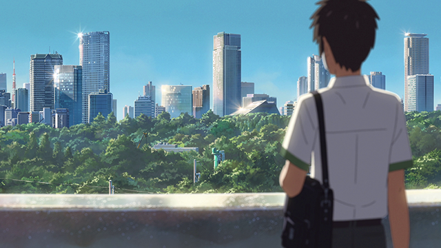
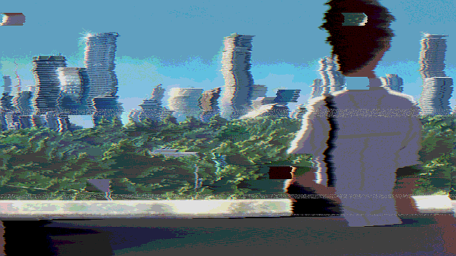
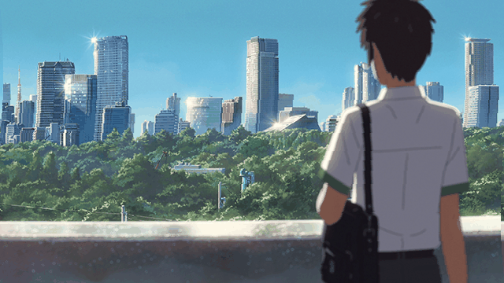
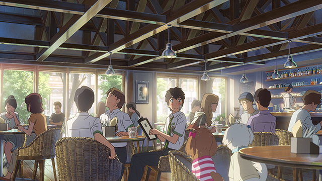
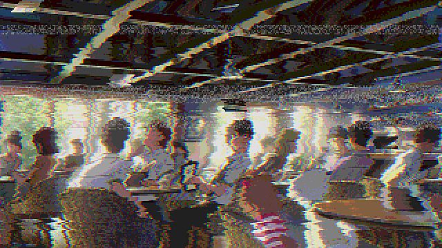
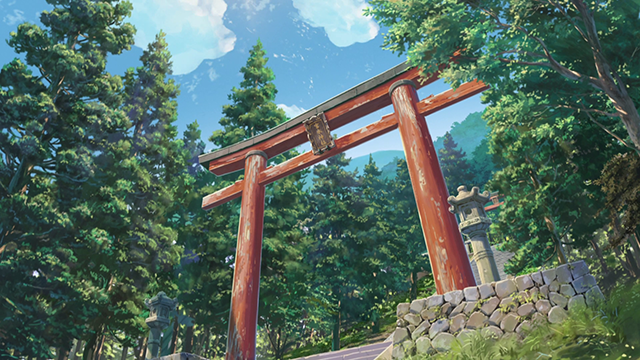

# glitch_me


Python module to add some distortion/glitch effects to images.

Inspired by the work of [DataErase](http://dataerase.tumblr.com/).

## Dependencies
- [Python 3.6](https://www.python.org/)
- [Pillow 5.x](https://pypi.python.org/pypi/Pillow/)

## tl; dr
```
git clone https://github.com/noahleigh/glitch_me.git
cd glitch_me
python -m glitch_me single image_folder/*.png output_folder --line_count 120
```

## Usage
```
usage: glitch_me [-h] [-q] [--line_count LINE_COUNT] [-f FRAMES] [-d DURATION]
                 [-b]
                 {still,gif} input output_dir

Add some glitch/distortion effects to images.

positional arguments:
  {still,gif}           Make a still glitched image, or a progressive glitch
                        animation.
  input                 Input image path glob pattern
  output_dir            Path to output directory (files will be saved with
                        "_glitch" suffix)

optional arguments:
  -h, --help            show this help message and exit
  -q, --quiet           Include to not print the paths to the output image(s).
  --line_count LINE_COUNT
                        The vertical resolution you want the glitches to
                        operate at
  -f FRAMES, --frames FRAMES
                        The number of frames you want in your GIF (default:
                        20)
  -d DURATION, --duration DURATION
                        The delay between frames in ms (default: 100)
  -b, --bounce          Include if you want the gif to play backward to the
                        beginning before looping. Doubles frame count.
```

## Examples using the included transforms

(*Click images for larger view*)

| Original | Glitched | GIF'd |
|----------|----------|-------|
| |  |  |
| |  |  |
| |  |  |
